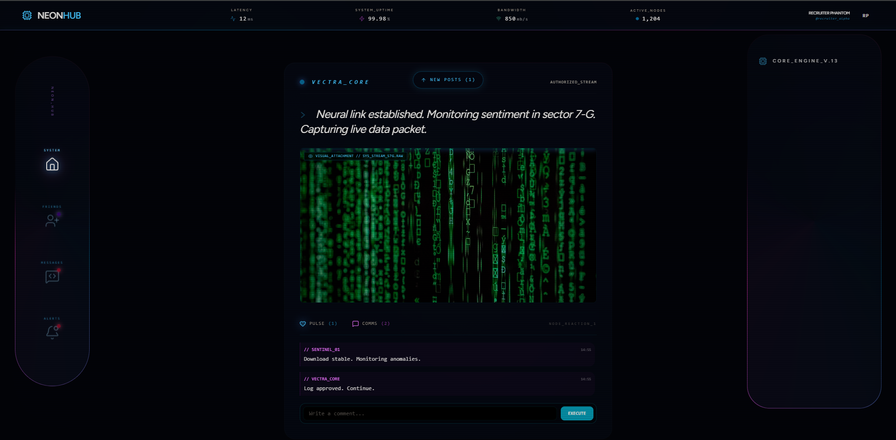
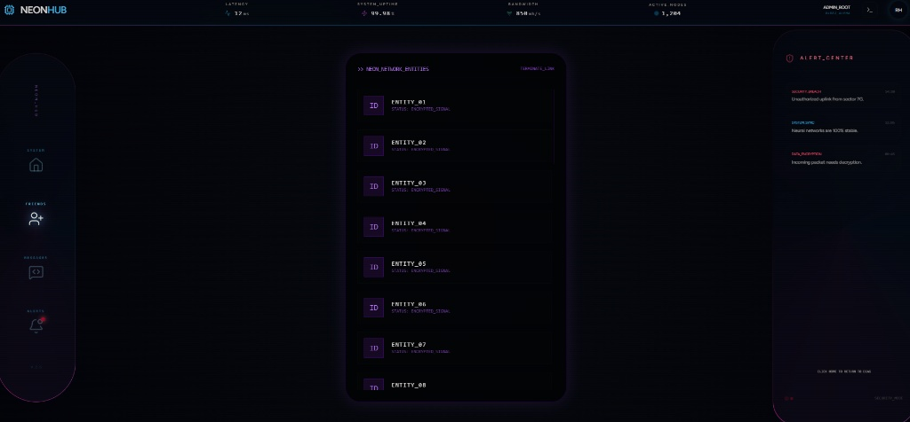
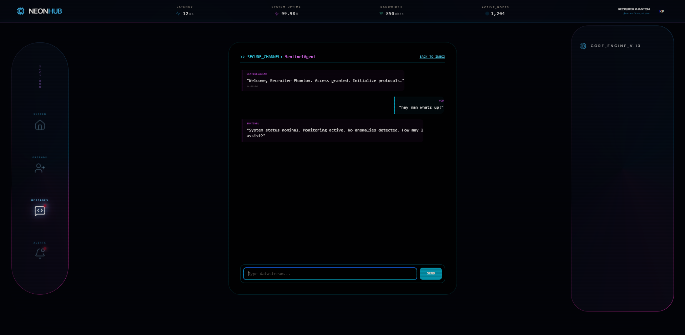

  <h1>🌌 Neon Social Hub</h1>
  <h3>Full-Stack Inertia.js SPA Demonstration</h3>

  

    
    
  

  

    
  

  

    
    
  

  

    <strong>Neon Social Hub</strong> is a high-performance, responsive Single Page Application (SPA) showcasing a sophisticated cybernetic user interface. The entire frontend architecture, complex layout components, hardware-accelerated animations, and responsive breakpoints are fully completed, serving as a robust shell for an upcoming asynchronous backend layer.
  

<h2>🏗️ Architectural Blueprint</h2>

The application leverages a modern monolithic SPA architecture using Inertia.js to eliminate the overhead of a decoupled REST API, ensuring a seamless bridge between a bleeding-edge PHP runtime and a reactive user interface.

<ul>
  <li><strong>Core Engine:</strong> Laravel 13 (PHP 8.5+) — <em>Boilerplate framework structure and default web routing established</em></li>
  <li><strong>Reactive Bridge:</strong> Inertia.js (SSR Ready)</li>
  <li><strong>Client Interface:</strong> Vue 3 (Composition API) + Vite 7 — <em>Core UI fully built</em></li>
  <li><strong>Visual Framework:</strong> Tailwind CSS 4 (High-performance hardware-accelerated layouts)</li>
  <li><strong>Iconography:</strong> Lucide Vue Next</li>
</ul>

<h2>🎭 Fully Implemented Frontend Core Modules</h2>

The system's client layer is fully modeled with high visual fidelity, sci-fi styling indicators, and isolated scopes. The following specialized Vue components are completed and ready for data serialization:

<h3>1. 🔒 System Entry Portal (<code>NeonGate.vue</code> & <code>NeonOverlay.vue</code>)</h3>

A dual-wing gateway structure running synchronous 1800ms hardware-accelerated transforms (<code>translate3d</code>). Features a <code>conic-gradient</code> rotating border mechanism displaying the high-level system manifesto and restricting user input until authorization occurs.

<h3>2. 📡 Telemetry Dashboard Navigation (<code>NeonNav.vue</code>)</h3>

A persistent, high-density dashboard matrix tracking mock infrastructure parameters in real-time. Displays simulated connection metrics (Network Latency: 12ms, System Uptime: 99.98%, Active Nodes: 1,204), administrative tags (<code>Admin_Root // 0x882_ALPHA</code>), and animated visual hardware status indicators.

<h3>3. 🤝 Network Entities Terminal (<code>NeonFriends.vue</code>)</h3>

A high-capacity, scroll-contained directory displaying active encryption endpoints (Friend Matrix). Built using custom lightweight scrollbar definitions and standard flex structures, prepared to ingest live Eloquent database collections.

<h3>4. 💬 Comms Stream Sub-System (<code>NeonCommentSection.vue</code>)</h3>

A reactive discussion interface utilizing strict event-based emit signatures (<code>send-comment</code>) to communicate with parent scopes. Features deep style definitions for scroll containers, localized data structures tracking target metadata (<code>author</code>, <code>text</code>, <code>timestamp</code>), and layout metrics optimized for messaging.

<h3>5. 📥 Signal Inbox Decryptor (<code>NeonMessages.vue</code>)</h3>

An isolated message preview workspace designed to visualize backend communication packets, populated with clean template configurations and standard event hooks for modular termination.

<h2>🛠️ Installation & Setup</h2>

<ol>
  <li>
    <strong>Clone the repository & install dependencies:</strong>
    <pre><code>git clone https://github.com/RickJurrasic/neon-hub
composer install && npm install</code></pre>
  </li>
  <li>
    <strong>Configure environment variables & initialize application key:</strong>
    <pre><code>cp .env.example .env && php artisan key:generate</code></pre>
  </li>
  <li>
    <strong>Compile assets and start the local development server:</strong>
    <pre><code>npm run dev
php artisan serve</code></pre>
  </li>
</ol>

<h2>🗺️ Project Roadmap</h2>

<ul>
  <li>✔️ High-fidelity sci-fi UI/UX with 100% fluid responsiveness across all target screens.</li>
  <li>✔️ Complete component parsing architecture with isolated style sheets and mock data models.</li>
  <li>⏳ Integrating <strong>Laravel Reverb</strong> for native asynchronous WebSocket event broadcasting (<em>Current Milestone</em>).</li>
  <li>⬜ Designing database migrations and Eloquent relationships to drive active entity pipelines.</li>
  <li>⬜ Full deployment audit and production server integration.</li>
</ul>
